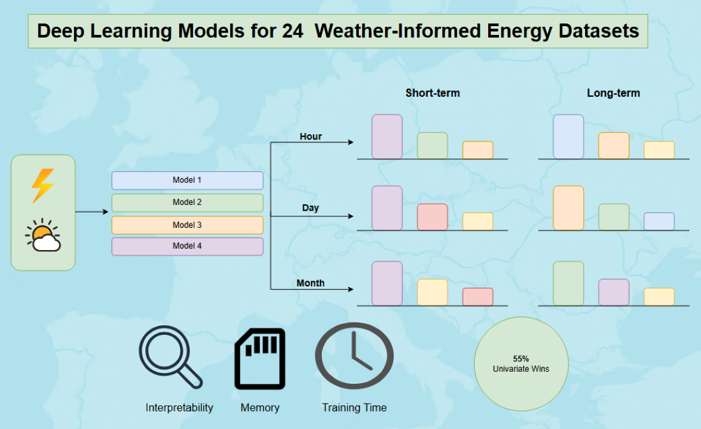

# 📊 A Comparative Evaluation of Time-Series Forecasting Models for Energy Datasets

This repository contains the code, datasets, and graphical abstract accompanying our paper:  **"A comparative evaluation of time-series forecasting models for Energy Datasets"**

In this work, we conduct a systematic comparative analysis of state-of-the-art deep learning models—such as **DLinear**, **NBEATS**, **NHITS**, **Autoformer**, **FEDformer**, and **Informer**—across a diverse collection of **24 energy-related time series**. These datasets are enriched with aligned **weather information** (e.g., temperature, wind speed, solar radiation) to reflect more realistic forecasting scenarios.

Our experiments evaluate model performance over **hourly**, **daily**, and **monthly** forecast horizons, considering both **short-** and **long-term** prediction tasks. We benchmark forecasting accuracy, training efficiency, and resource usage to provide a comprehensive understanding of each model's strengths and limitations.

---

## 📁 What's Included

- 🧠 Implementation built using [NeuralForecast](https://github.com/Nixtla/neuralforecast) library  
- ⚡ A variety of energy datasets (consumption, generation) from [ENTSO-E](https://www.entsoe.eu/)
- 🌦️ Matched weather datasets used as exogenous variables from [Open-Meteo](https://open-meteo.com/)
- 📊 Model training, evaluation scripts, and metrics  
- 🖼️ A graphical abstract summarizing the methodology and results  

---

## 🔁 Reproducibility

To support transparency and future work, the **necessary code and datasets** are publicly available in this repository
under the Creative Commons Attribution-NonCommercial-ShareAlike 4.0 International License (https://creativecommons.org/licenses/by-nc-sa/4.0/).

---

## 📄 Reference
We kindly request that you cite our paper along with the original websites from which the datasets were sourced.

> *A comparative evaluation of time-series forecasting models for Energy Datasets*  
> *Nikitas Maragkos, Ioannis Refanidis*  
> *Computers / SI: Artificial Intelligence-Driven Innovations in Resilient Energy Systems, 2025 
> [https://doi.org/10.3390/computers14070246](https://doi.org/10.3390/computers14070246)

 
BibTeX Current Paper

@article{maragkos2025comparative,
  title={A Comparative Evaluation of Time-Series Forecasting Models for Energy Datasets},
  author={Maragkos, Nikitas and Refanidis, Ioannis},
  journal={Computers},
  volume={14},
  number={7},
  pages={246},
  year={2025},
  publisher={MDPI}
}

> Zippenfenig, P. (2023). *Open-Meteo.com Weather API*. Zenodo. https://doi.org/10.5281/zenodo.7970649  
> License: [CC BY 4.0](https://creativecommons.org/licenses/by/4.0/)
Website: [https://open-meteo.com/](https://open-meteo.com/)

 
BibTeX Open-Meteo

@software{Zippenfenig_Open-Meteo,
  author = {Zippenfenig, Patrick},
  doi = {10.5281/zenodo.7970649},
  license = {CC-BY-4.0},
  title = {Open-Meteo.com Weather API},
  year = {2023},
  copyright = {Creative Commons Attribution 4.0 International},
  url = {https://open-meteo.com/}
}

 
BibTeX NeuralForecast

@misc{olivares2022library_neuralforecast,
    author={Kin G. Olivares and
            Cristian Challú and
            Federico Garza and
            Max Mergenthaler Canseco and
            Artur Dubrawski},
    title = {{NeuralForecast}: User friendly state-of-the-art neural forecasting models.},
    year={2022},
    howpublished={{PyCon} Salt Lake City, Utah, US 2022},
    url={https://github.com/Nixtla/neuralforecast}
}

