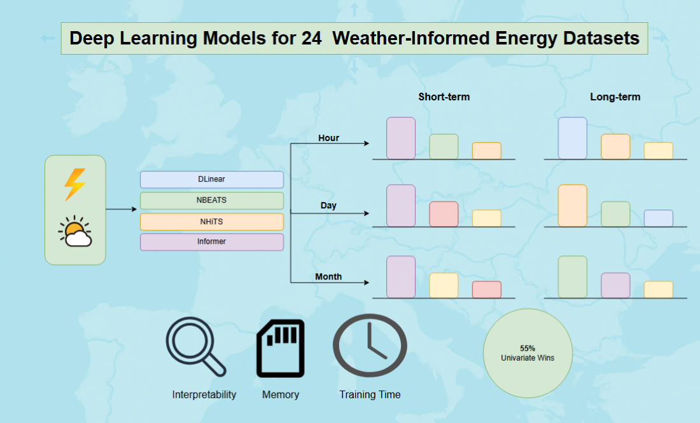

# 📊 Comparative Evaluation of Deep Learning Models on Weather-Informed Energy Forecasting

This repository contains the code, datasets, and graphical abstract accompanying our paper:  
**"A comparative evaluation of time-series forecasting models for Energy Datasets"**

In this work, we conduct a systematic comparative analysis of state-of-the-art deep learning models—such as **DLinear**, **NBEATS**, **NHITS**, **Autoformer**, **FEDformer**, and **Informer**—across a diverse collection of **24 energy-related time series**. These datasets are enriched with aligned **weather information** (e.g., temperature, wind speed, solar radiation) to reflect more realistic forecasting scenarios.

Our experiments evaluate model performance over **hourly**, **daily**, and **monthly** forecast horizons, considering both **short-** and **long-term** prediction tasks. We benchmark forecasting accuracy, training efficiency, and resource usage to provide a comprehensive understanding of each model's strengths and limitations.

---

## 📁 What's Included

- 🧠 Implementation built on top of the [NeuralForecast](https://github.com/Nixtla/neuralforecast) library  
- ⚡ A variety of energy datasets (consumption, generation)  
- 🌦️ Matched weather datasets used as exogenous variables  
- 📊 Model training, evaluation scripts, and metrics  
- 🖼️ A graphical abstract summarizing the methodology and results  

---

## 🔁 Reproducibility

To support transparency and future work, the **necessary code and datasets** will be made publicly available prior to the publication of the paper.

---

## 📄 Reference

> *[Title of the paper to appear here]*  
> *Authors to be listed*  
> *Journal / Conference, Year*  
> [DOI or link – coming soon]
